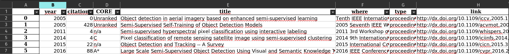

# bibtex2crossref

This script fetches information regarding the bibtex papers, such as #citations and the [CORE rank](https://portal.core.edu.au/conf-ranks/) of the conference papers. We use the crossref API and the CORE rank website.

Output example:

If you use zotero/mendeley, you can export to bibtex and then use this script to generate an Excel file with your papers.
